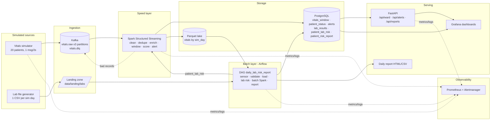

# Hospital Patient Vital Signs Monitoring — Project Plan

**Module:** EC8203 Applied Big Data Engineering — Mini Project (25%) · **Use case 2** · **Team:** 3 members (A, B, C) · **Duration:** 14 days

> Members are placeholders (A/B/C). Replace with names in section 1 once agreed.
> "D1…D14" = project days counted from kickoff. Map them to calendar dates at the kickoff meeting.

---

## 1. Team & ownership at a glance

| | Member A | Member B | Member C |
|---|---|---|---|
| **Name** | _TBD_ | _TBD_ | _TBD_ |
| **Role** | Platform, Ingestion & Observability | Speed layer (Spark Streaming) & Data Lake | Batch layer, Serving & Reporting |
| **Owns** | Docker Compose, Kafka, both simulators, shared lib, metrics/alerts, Grafana | Spark Structured Streaming job, scoring/alert logic, Parquet lake, stream sinks | Postgres schema, Airflow DAG, batch Spark job, daily report, FastAPI |
| **Rubric focus** | Ingestion (15), Observability (10), Code quality (5) | Processing (15), Architecture (20) | Storage & Serving (10), Processing (15, batch half) |
| **Est. effort** | ~65 h | ~66 h | ~63 h |
| **Report sections** | Ingestion, Tech stack, Observability | Architecture decision, Processing, Storage | Use case & requirements, Serving, Results, Limitations |

Everyone must be able to explain **every** architectural decision and the core logic of **all** modules in the viva (assignment rule). Hence the cross-review rule in section 9.

### 1.1 Ownership rules for shared areas (single owner = final say; others contribute via PR)

| Shared area | Owner (final say) | Contributors and what they do |
|---|---|---|
| **Observability** | **A** | A owns Prometheus, Alertmanager, alert rules, Grafana and the log format. **Each component owner instruments their own code** with the agreed metric names (4.7) and JSON logs (4.8): B → Spark metrics (B9), C → Airflow and API metrics (C3, C6, C7), A → simulators and infra. A does not write metrics code inside B's or C's modules. |
| **Postgres schema** (`sql/init.sql`) | **C** | B and A request column changes via PR to C; B reviews the streaming tables. B writes `vitals_window`, `patient_status`, `alerts`, `dlq_events`. A writes `patients` (seed). C writes `lab_results`, `patient_lab_risk`, `patient_risk_report`. |
| **`common/scoring.py`** (risk rules) | **B** | C imports it in the batch job and may not edit it directly; C requests changes from B. A owns the rest of `common/` (config, sim_clock, logging, schemas). |
| **Lambda vs Kappa chapter** | **B** writes it | A and C each add one paragraph: A on ingestion/replay (Kafka retention), C on serving/consistency (merging speed and batch views). All three defend it in the viva. |
| **Architecture diagram** | **A** | B and C check that their layer is drawn correctly. |
| **Grafana dashboards** | **A** builds | C provides API/Postgres queries for the ward view; B provides the streaming metrics. |
| **Docker Compose** | **A** | B and C add their own service definitions (Spark job, Airflow, API) by PR. |
| **README** | **A** | B and C write their own "how to run / how to test" subsection. |
| **Demo video and contribution statement** | **C** coordinates | All record their own part. |

---

## 2. Key decisions (proposed — confirm at kickoff, D1)

### 2.1 Architecture: **Lambda**
Rationale (this is the argument the report must make in depth):

| Requirement of the use case | Why it points to Lambda |
|---|---|
| **Latency** — "which patients show concerning trends *right now*" | Speed layer (Spark Structured Streaming) gives seconds-level alerts/trends. |
| **Two sources with different nature** — continuous vitals vs. one lab file/day | Labs are inherently batch: arrive once, can be late, corrected, or re-sent. Forcing them through a log-based stream adds complexity for no latency benefit. |
| **Correctness / consistency** — daily risk report must be trustworthy | Batch layer recomputes the whole day from immutable Parquet (source of truth), handling late/duplicate events that the watermark-bound speed layer dropped; we *measure and report* the speed-vs-batch discrepancy. |
| **Replay / backfill** | Batch layer can be re-run for any sim-day from the lake, independent of Kafka retention. |
| **Serving** | Serving layer merges: real-time tables (speed) + daily risk tables (batch). |
| **Fit with mandated stack** | Airflow is a batch orchestrator — it has a natural, non-artificial job in Lambda. |

**Rejected alternative — Kappa.** Would put labs on a compacted Kafka topic and derive everything from one streaming codebase (less code duplication, one logic path). Rejected because: (1) reprocessing requires long Kafka retention or a replay from a lake anyway; (2) the daily report is a full-history recomputation where batch semantics (idempotent partition overwrite) are simpler and safer; (3) Airflow would have almost nothing meaningful to do. **Honest trade-off to state in report:** Lambda duplicates scoring logic across two layers → mitigated by one shared `scoring.py` module used by both.

### 2.2 Simulated clock
- **1 simulated day = 5 real minutes** (`SIM_DAY_SECONDS=300`, configurable).
- `sim_day = floor((now − SIM_EPOCH) / 300) + 1`; `SIM_EPOCH` fixed at stack start.
- Vitals: each of **20 patients** emits one reading every **2 s** (~10 msg/s, ~3 000 msgs per sim day).
- Lab file for day *N−1* (labs collected "yesterday") is dropped at the start of sim day *N*. That file feeds "yesterday's lab results".
- Airflow DAG runs every 5 real minutes (= one sim day).
- **Caveat to state in report:** at this compression, a "5-minute vitals trend" is a large fraction of a sim day; clinical trend windows are therefore scaled down (2-min windows). Not clinically calibrated.

### 2.3 Technology stack

| Layer | Choice | Justification (tie to use case) |
|---|---|---|
| Ingestion | **Kafka** (KRaft, 1 broker, topic `vitals.raw` with **3 partitions, key = patient_id**) | Per-patient ordering is required for trend calculation → key by patient. Partitions demonstrate parallelism; replayable log; decouples bedside monitors from processing. |
| Stream processing | **Spark Structured Streaming** | Event-time windows + watermarks for out-of-order sensor data; stream-static join with lab risk; same engine (PySpark) for batch layer → shared code. Storm rejected: no native event-time windows/exactly-once sinks at this effort. |
| Orchestration | **Airflow** (LocalExecutor) | Daily dependency chain: wait for lab file → validate → load → risk → report → health check; retries, backfill, run history. |
| Speed-layer store + serving | **PostgreSQL** | Small aggregates, needs upserts, ad-hoc SQL, easy Grafana/FastAPI integration. Cassandra rejected: no need for write-scale, poor ad-hoc joins. |
| Batch layer store | **Parquet on local volume** (S3/HDFS stand-in), partitioned by `sim_day` | Immutable master dataset; cheap columnar scans for daily recompute. |
| Serving API | **FastAPI** | Real-time ward figures API (required output); OpenAPI docs for free; `/metrics` endpoint. |
| Dashboards | **Grafana** | Live ward view + pipeline-health view over Postgres/Prometheus. |
| Observability | **structured JSON logs + Prometheus + Alertmanager + Grafana** | Metrics + alert rules as code; kafka-exporter for consumer lag. |
| Packaging | **Docker Compose** | One-command reproducibility (strongly recommended by brief). |

---

## 3. Architecture diagram (put a polished version in the report)



The dashed `patient_lab_risk → Spark` arrow is the piece that answers the second half of the business question: **yesterday's labs change tomorrow's risk picture** (raise a patient's risk tier / lower alert thresholds in the speed layer).

---

## 4. Shared contracts (agree & freeze by end of D2 — this is what lets three people work in parallel)

### 4.1 Kafka
| Topic | Partitions | Key | Value |
|---|---|---|---|
| `vitals.raw` | 3 | `patient_id` | JSON below |
| `vitals.dlq` | 1 | `patient_id` | `{reason, raw_payload, failed_at}` |

```json
{
  "event_id": "uuid4",
  "patient_id": "P001",
  "heart_rate": 78,
  "spo2": 97,
  "systolic_bp": 121,
  "diastolic_bp": 79,
  "temperature": 36.8,
  "timestamp": "2026-03-01T10:15:02.123Z",
  "sim_day": 3
}
```
`timestamp` is event time (UTC ISO-8601). Extra fields beyond the brief (`event_id`, `sim_day`) are deliberate: dedupe key and partitioning by sim day.

### 4.2 Lab file (landing zone)
`data/landing/labs/labs_day_003.csv` — written to `*.tmp` then atomically renamed (so the sensor never reads a partial file).
```
patient_id,test_type,result_value,reference_range,collected_at
P001,lactate,3.1,0.5-2.0,2026-03-01T08:30:00Z
```
`test_type` ∈ {potassium, creatinine, lactate, wbc, crp, hemoglobin, glucose}. `reference_range` is `low-high` text. Processed files move to `processed/`, invalid to `quarantine/`.

### 4.3 Parquet lake
`data/lake/vitals/sim_day=<N>/part-*.parquet` — cleaned readings (all raw columns + `map`, `news_score`, `ingested_at`).

### 4.4 PostgreSQL tables (owner: C; B reviews)
| Table | Written by | Key columns |
|---|---|---|
| `patients` | seed script (A) | patient_id, name/alias, age, bed, ward, comorbidity_flag, baseline HR/BP |
| `vitals_window` | Spark (B) | patient_id, window_start, window_end, `avg_/min_/max_` + `heart_rate`, `spo2`, `systolic_bp`, `diastolic_bp`, `temperature` (e.g. `avg_heart_rate`, `min_spo2`), n_readings, trend_slope_hr, trend_slope_spo2 |
| `patient_status` | Spark (B) | patient_id, last_reading_at, latest vitals as `heart_rate`, `spo2`, `systolic_bp`, `diastolic_bp`, `temperature`, news_score, lab_risk_points, risk_tier (`LOW`/`MEDIUM`/`HIGH`/`CRITICAL`), trend_flag |
| `alerts` | Spark (B) | alert_id, patient_id, severity, reason_code, value, threshold, opened_at, resolved_at |
| `dlq_events` | Spark (B) | reason, payload, failed_at |
| `lab_results` | Airflow (C) | patient_id, test_type, result_value, ref_low, ref_high, abnormal_flag, collected_at, sim_day |
| `patient_lab_risk` | Airflow (C) | patient_id, lab_risk_points, abnormal_tests[], as_of_sim_day |
| `patient_risk_report` | Airflow (C) | sim_day, patient_id, vitals_summary, lab_summary, risk_before_labs, risk_after_labs, rank |
| `pipeline_run_log` | all | stage, run_id, status, rows_in, rows_out, started_at, finished_at |

All writes idempotent (upsert on natural key / overwrite the sim-day partition) so replays are safe.

### 4.5 Risk scoring (shared module `common/scoring.py`, used by **both** layers)
Adapted from NEWS2 using only fields in the feed (no respiration rate/consciousness → **simplified, not clinical**; say so in the report).

| Score | HR | SpO₂ | Systolic BP | Temp °C |
|---|---|---|---|---|
| 3 | ≤40 or ≥131 | ≤91 | ≤90 or ≥220 | ≤35.0 |
| 2 | 111–130 | 92–93 | 91–100 | ≥39.1 |
| 1 | 41–50 or 91–110 | 94–95 | 101–110 | 35.1–36.0 or 38.1–39.0 |
| 0 | 51–90 | ≥96 | 111–219 | 36.1–38.0 |

`news_score = sum`. **Lab points** (from `patient_lab_risk`): +2 lactate high, +2 potassium out of range, +1 each for creatinine high, WBC high, CRP high, hemoglobin low, glucose out of range (cap at +4).
`total = news_score + lab_risk_points` → **LOW 0–2 · MEDIUM 3–4 · HIGH 5–6 · CRITICAL ≥7**; any single vital scoring 3 ⇒ at least MEDIUM.
**Trend flag:** slope of avg HR (↑) / SpO₂ (↓) / SBP (↓) across the last 5 windows beyond threshold, or news_score rising in ≥3 consecutive windows.
**Alert rules (with 60 s cooldown per patient+reason):** total ≥5; single-vital score 3; sustained abnormal (≥3 consecutive windows with news ≥3); worsening trend flag.

### 4.6 API (owner C)
| Endpoint | Purpose |
|---|---|
| `GET /api/ward/summary` | Patients by risk tier, active alerts, avg vitals, readings/min, data freshness |
| `GET /api/patients` · `GET /api/patients/{id}` | Current status incl. news score, lab points, trend flag |
| `GET /api/patients/{id}/vitals?minutes=10` | Recent windows for charts |
| `GET /api/alerts?status=open&severity=` | Alert list |
| `GET /api/reports/risk/latest` · `/api/reports/risk/{sim_day}` | Daily consolidated report (JSON) |
| `GET /health` | Liveness + data-freshness check (503 if no data > N s) |
| `GET /metrics` | Prometheus exposition |

### 4.7 Metric names (Prometheus)
`vitals_produced_total{patient}` · `vitals_produce_errors_total` · `spark_input_rows_per_sec` · `spark_batch_duration_seconds` · `spark_watermark_lag_seconds` · `vitals_dlq_total` · `vitals_valid_total` · `alerts_opened_total{severity}` · `lab_files_ingested_total` · `lab_file_missing_total` · `airflow_dag_last_success_timestamp` · `speed_batch_discrepancy_ratio` · `api_request_duration_seconds` · `pipeline_last_event_age_seconds` (+ `kafka_consumergroup_lag` from kafka-exporter)

### 4.8 Structured log format (one JSON object per line, every service)
`{"ts","level","service","stage":"ingestion|processing|storage|serving|orchestration","event","run_id|trace_id","patient_id?","rows?","duration_ms?","error?"}`

---

## 5. Repository layout

```
.
├── docker-compose.yml        .env.example        Makefile        README.md
├── common/                   # A: config, sim_clock, logging, schemas (pydantic)   B/C: scoring.py
├── simulators/
│   ├── vitals_producer.py    # A
│   ├── lab_generator.py      # A
│   └── seed_patients.py      # A
├── kafka/create_topics.sh    # A
├── streaming/                # B
│   ├── stream_job.py  validation.py  windows.py  alerts.py  sinks.py  metrics_listener.py
├── batch/                    # C
│   └── daily_vitals_job.py  lab_risk.py  report.py
├── airflow/dags/daily_lab_risk_report.py      # C
├── serving/api/              # C  (main.py, routers/, models.py)
├── sql/init.sql              # C
├── observability/            # A  prometheus.yml, alert_rules.yml, alertmanager.yml, grafana/provisioning/
├── data/                     # gitignored: landing/, lake/, reports/, checkpoints/
├── tests/                    # each owner adds tests for their module
└── docs/                     # diagrams, screenshots, report source
```

---

## 6. Timeline & milestones

| Days | Phase | Outcome |
|---|---|---|
| **D1–D2** | Design & contracts | Decisions confirmed, contracts (section 4) frozen, repo scaffold, Compose skeleton boots Kafka + Postgres |
| **D3–D5** | **Walking skeleton** | Producer → Kafka → Spark (parse + simple window) → Postgres → API `/ward/summary` — ugly but end-to-end. **Milestone M1 (D5): demo the skeleton.** |
| **D6–D8** | Batch layer + real logic | Lab generator, Airflow DAG, batch job, full scoring/trend/alert logic, metrics exposed. **M2 (D8): both layers run, lab risk feeds speed layer.** |
| **D9–D10** | Serving, observability, robustness | Report, dashboards, alert rules firing, fault injection (bad records, missing lab file), DLQ |
| **D11–D12** | Integration & hardening | Tests green, 30-min soak run (≥6 sim days), README verified on a clean machine. **M3 (D12): code freeze.** |
| **D13** | Report & video | Report PDF assembled, screenshots, demo video recorded |
| **D14** | Buffer & submit | Proofread, repo link/zip, contribution statement. No new features. |

Cadence: 15-min daily stand-up (yesterday / today / blocked), integration checkpoints on D5, D8, D12.

---

## 7. Detailed tasks per member

Hours are estimates for planning. **Dep** = must be done first.

### 7.1 Member A — Platform, Ingestion & Observability (~65 h)

| ID | Task | Acceptance criteria | Dep | Days | h |
|---|---|---|---|---|---|
| A1 | Repo scaffold: `.env.example`, Makefile (`up`, `down`, `test`, `e2e`), `.gitignore`, lint config | `make up` works on a fresh clone | – | D1 | 2 |
| A2 | Docker Compose: Kafka (KRaft), Postgres (2 DBs: app + airflow), Spark image, Airflow, Prometheus, Grafana, API; healthchecks, memory limits, named volumes | `docker compose up` brings everything healthy on 16 GB RAM (target ≤ 8 GB) | A1 | D1–D3 | 8 |
| A3 | `common/`: config loader, `sim_clock`, JSON logging helper (section 4.8), pydantic event schemas | Imported by all services; unit-tested | A1 | D2 | 5 |
| A4 | **Vitals simulator**: 20 patients with physiological baselines (random walk + noise), 3–4 patients with scripted *deterioration episodes* (gradual HR↑ SpO₂↓ SBP↓), random abnormal spikes, keyed by patient_id, idempotent producer (`acks=all`), retry/back-off, graceful SIGTERM, seedable RNG. **Fault injection (flag-controlled):** nulls, out-of-range garbage (HR=0/999), duplicates, out-of-order/late events, sensor dropout | Runs continuously; ≈10 msg/s; every fault type observable downstream | A3 | D2–D5 | 10 |
| A5 | `create_topics.sh` + doc of partition/retention choices | Topics exist after `up` | A2 | D3 | 2 |
| A6 | **Lab generator**: one CSV per sim day for the previous day, values correlated with the deterioration episodes (so lab risk is meaningful), atomic drop, occasionally late/missing/corrupt file (flag-controlled) | File appears at each sim-day boundary; matches contract 4.2 | A3, A4 | D5–D7 | 6 |
| A7 | `seed_patients.py` + Prometheus scrape config, kafka-exporter, producer metrics | Prometheus shows all targets UP | A2 | D6 | 4 |
| A8 | **Alert rules** (Prometheus + Alertmanager → webhook logged to file): `NoVitalsData` (>60 s), `ConsumerLagHigh`, `DlqRateHigh` (>5 %), `StreamingQueryStopped`, `LabFileMissing`, `ApiDown`, `DagFailed` | Each rule demonstrably fires when the fault is injected (screenshot each) | A7, B9, C3 | D7–D9 | 6 |
| A9 | **Grafana dashboards** (provisioned as code): (1) Ward live view — risk tiers, alerts, per-patient vitals; (2) Pipeline health — throughput, lag, batch duration, DLQ, DAG status | Loads with no manual clicks after `up` | A7, C6 | D8–D10 | 7 |
| A10 | Tests: simulator (ranges, faults, determinism with seed), sim_clock, schema contracts; GitHub Actions CI (lint + pytest) | CI green on PR | A3, A4 | D4–D10 | 5 |
| A11 | E2E smoke test (`make e2e`) + 30-min soak run & result notes | Script asserts rows in Postgres, alert raised, report produced | all | D11–D12 | 4 |
| A12 | README (architecture summary, setup, run, reproduce, troubleshooting); **report:** ingestion, tech-stack justification, observability design | Peer can reproduce from README alone | all | D11–D13 | 6 |

### 7.2 Member B — Speed layer (Spark Structured Streaming) & Lake (~66 h)

| ID | Task | Acceptance criteria | Dep | Days | h |
|---|---|---|---|---|---|
| B1 | Write scoring/alert spec (section 4.5) as `common/scoring.py` (pure functions) shared by both layers | Unit tests cover all threshold boundaries | – | D1–D2 | 4 |
| B2 | Spark container: Spark + Kafka connector + JDBC driver; submit command in Compose; checkpoint dir | `stream_job.py` starts and connects to Kafka | A2 | D2–D3 | 4 |
| B3 | **Ingest & validate:** read Kafka, explicit schema, type casting, range validation, null checks; invalid → `vitals.dlq` + `dlq_events`; `dropDuplicates(event_id)` within watermark | Injected faults land in DLQ/deduped; counts reconcile (valid + dlq = input) | A4 | D3–D5 | 8 |
| B4 | **Enrichment:** static join with `patients`; derive MAP, pulse pressure, per-reading `news_score` (via B1) | Columns present in sink | B1, B3 | D4–D6 | 6 |
| B5 | **Windowed aggregation:** event-time sliding window (2 min / 30 s), watermark 1 min, avg/min/max/count; trend slopes (regression over last 5 windows) + sustained-abnormal counter | Values verified against hand-computed test set | B4 | D5–D8 | 8 |
| B6 | **Sinks (`foreachBatch`):** idempotent upserts to `vitals_window`, `patient_status`, `alerts`; append cleaned readings to Parquet partitioned by `sim_day`; checkpointing; restart recovery test (kill & restart → no duplicates) | Kill/restart leaves consistent data | B5, C1 | D5–D8 | 8 |
| B7 | **Alert engine:** rules from 4.5, severity, reason codes, cooldown/dedup, open → resolved lifecycle | Spikes and deterioration episodes raise exactly the expected alerts | B5, B6 | D7–D9 | 6 |
| B8 | **Lab feedback loop:** stream-static join to `patient_lab_risk` (refresh each micro-batch) so total risk/tier reflects yesterday's labs | Tier of a lab-abnormal patient rises after the DAG runs (before/after evidence for the report) | B7, C3 | D8–D10 | 5 |
| B9 | **Streaming metrics:** `StreamingQueryListener` → Prometheus-format metrics (input rate, batch duration, watermark lag, valid/DLQ counts, last-event age) + structured logs per micro-batch | Metrics visible in Prometheus/Grafana | B6, A7 | D8–D9 | 5 |
| B10 | Tests: unit tests (scoring, validation, alert rules); local-mode Spark integration test on a fixture file | `pytest` green in CI | B3–B7 | D5–D11 | 6 |
| B11 | Performance/tuning notes (shuffle partitions, trigger interval, memory) ; **report:** architecture decision (Lambda vs Kappa, rejected alternative), processing layer, storage design | Draft by D11 | all | D10–D13 | 6 |

### 7.3 Member C — Batch layer, Serving & Reporting (~63 h)

| ID | Task | Acceptance criteria | Dep | Days | h |
|---|---|---|---|---|---|
| C1 | **`sql/init.sql`** (all tables in 4.4, indexes, keys, `pipeline_run_log`); B reviews; runs on container start | Schema loads clean; B/A can code against it by D3 | – | D1–D3 | 6 |
| C2 | **Airflow setup:** image with JDK + pyspark, LocalExecutor, mounts for `data/` and code, connections via env | Airflow UI up, DAG list shows the DAG | A2 | D3–D5 | 5 |
| C3 | **DAG `daily_lab_risk_report`:** `wait_for_lab_file` (FileSensor) → `validate_lab_file` (schema, types, dupes, unknown patients → quarantine) → `load_lab_results` (idempotent) → `compute_lab_risk` (abnormal flag from reference_range → `patient_lab_risk`) → `batch_vitals_job` → `build_risk_report` → `data_quality_and_health_check` → `archive_file`. Retries, SLA, `on_failure_callback` (structured log + metric) | Full run produces report; re-run of same day gives same result; missing file → sensor timeout → alert | C1, C2, A6 | D5–D9 | 12 |
| C4 | **Batch Spark job:** recompute the full previous-day vitals from Parquet (per patient: min/max/avg, time in abnormal range, trend), **reconcile against speed-layer aggregates** and publish `speed_batch_discrepancy_ratio` (demonstrates the Lambda merge and why the batch layer exists) | Discrepancy metric reported per day | B6 | D6–D9 | 6 |
| C5 | **Daily consolidated risk report:** ranked patients, vitals trend summary, latest lab flags, *risk before vs after labs*, sparklines; output HTML + CSV per sim day in `data/reports/` and `patient_risk_report` table | Answers "how do yesterday's labs change the risk picture" per patient | C3, C4 | D8–D10 | 8 |
| C6 | **FastAPI serving layer** (4.6): Pydantic models, pagination, OpenAPI, `/health` with freshness rule, `/metrics`; **skeleton with `/ward/summary` by D5** for M1 | All endpoints return correct data under live load | C1, B6 | D4–D9 | 10 |
| C7 | Failure handling & idempotency checks for the batch layer (replay a sim day, corrupt lab file, missing patient) | Documented outcome for each case | C3 | D9–D10 | 3 |
| C8 | Tests: lab parsing/abnormal flag, risk merge, API (TestClient + test DB), DAG import test | `pytest` green in CI | C3, C6 | D6–D11 | 6 |
| C9 | **Report:** use case & interpreted requirements, serving layer, results (screenshots of API, dashboard, report), limitations/production-scale discussion; coordinate demo video & contribution statement | Draft by D11 | all | D10–D13 | 7 |

### 7.4 Joint tasks

| ID | Task | Who | When |
|---|---|---|---|
| J1 | Kickoff workshop: confirm Lambda decision, sim clock, patient count, thresholds; assign names | All | D1 (2–3 h) |
| J2 | Contracts sign-off (section 4) — any later change needs all three to agree and a note in `docs/CHANGELOG.md` | All | D2 |
| J3 | **M1** walking-skeleton integration & demo | All | D5 |
| J4 | **M2** two-layer integration, lab → speed feedback verified | All | D8 |
| J5 | Cross-review: each member reads and can explain another member's core module (viva prep) | All | D10–D12 |
| J6 | Soak run, freeze, README dry-run on a clean clone | All | D12 |
| J7 | Report assembly, diagrams, proofread (A edits, B/C review) | All | D13 |
| J8 | Demo video (5–10 min) + individual contributions statement | All | D13 |

---

## 8. Hand-offs (who blocks whom)

| Producer → Consumer | Artifact | Needed by |
|---|---|---|
| C → A, B | `sql/init.sql` schema | D3 |
| A → B | Running Kafka + producer emitting contract 4.1 | D3 |
| B → C | `scoring.py`; Parquet lake layout; `vitals_window`/`patient_status` rows | D4 / D6 |
| A → C | Lab CSV files in landing zone | D6 |
| C → B | `patient_lab_risk` rows | D8 |
| B, C → A | Metric endpoints (Spark, Airflow, API) | D8 |
| C → A | API + Postgres for Grafana | D8 |

**Unblocking tip:** until real components exist, each person uses fixtures — B uses a canned JSON file for Kafka input, C inserts hand-written rows, A publishes sample lab CSVs — so nobody idles waiting.

---

## 9. Working agreements

- **Git:** `main` protected; feature branches `a/<task>`, `b/<task>`, `c/<task>`; small PRs; **each PR reviewed by a different member** (this also serves viva preparation). Conventional commit messages.
- **Definition of done (per task):** works in Compose · has a test or scripted check · logs structured JSON · configurable through `.env` · documented in README or docstring.
- **Config:** everything via `.env` (topic names, sim day length, thresholds, fault-injection flags); no hard-coded paths.
- **Contract changes:** see J2. Never silently rename a column, topic, or metric.
- **Windows/Docker note:** Docker Desktop with WSL2 — allocate ≥ 8 GB to WSL2 (`.wslconfig`), keep repo inside WSL or ensure LF line endings on shell scripts (`.gitattributes`).
- **Feature freeze:** end of D12. D13–D14 are for report, video, bugfix only.

---

## 10. Demo script (5–10 min) & acceptance checklist

1. `docker compose up -d` → show all containers healthy (Grafana pipeline-health dashboard).
2. Show simulator logs (JSON) and Kafka topic with partitions/consumer lag.
3. Ward live dashboard + `GET /api/ward/summary`; a deteriorating patient's tier climbs; alert opens.
4. Inject faults: bad records → DLQ counter rises, `DlqRateHigh` fires; stop producer → `NoVitalsData` fires.
5. Sim-day boundary: lab file lands → Airflow DAG runs (show graph view) → daily risk report opens; show a patient whose tier changed after labs.
6. Show batch-vs-speed discrepancy metric and explain Lambda merge.
7. Restart Spark job → no duplicates (checkpoint/idempotent upsert).

**Acceptance checklist (tick before D12 freeze):**
- [ ] Both sources run from Python scripts; sim clock documented
- [ ] Kafka topic with ≥3 partitions, keyed
- [ ] Spark Structured Streaming with event-time windows + watermark
- [ ] Airflow DAG executes daily with retries and a sensor
- [ ] Results in PostgreSQL (queryable) and Parquet
- [ ] Real-time ward API + threshold alerts per patient + daily consolidated risk report
- [ ] Structured logs in ingestion, processing, storage stages
- [ ] Metrics endpoint + ≥ 3 alert rules demonstrated firing
- [ ] Automated tests + CI green
- [ ] README lets a stranger reproduce with `make up`

---

## 11. Rubric traceability

| Rubric criterion (marks) | Where satisfied | Owner(s) |
|---|---|---|
| Architecture decision & justification (20) | §2.1, report chapter, batch-vs-speed discrepancy metric as evidence | B (lead), all |
| Tech stack justification (10) | §2.3, report chapter tied to use-case constraints | A |
| Data ingestion (15) | A4, A6 (fault injection, retries, atomic drops, seeding) | A |
| Processing (15) | B3–B8 (streaming), C3–C4 (batch), shared scoring | B, C |
| Storage & serving (10) | C1, C6, B6 | C |
| Observability (10) | A7–A9, B9, C7, JSON logs, alert rules | A |
| Report (15) | Chapters by owner (§1), diagrams, honest limitations | All |
| Code quality & docs (5) | README, Compose, CI, tests, `.env` | A |

---

## 12. Risks & mitigations

| Risk | Likelihood | Mitigation |
|---|---|---|
| Stack too heavy for laptops (Kafka + Spark + Airflow + Postgres + Grafana) | High | Memory limits per container, single-broker Kafka, Spark local mode, Airflow LocalExecutor, shared Postgres instance; test resource use on D3 |
| Spark ↔ Kafka connector/version mismatch | Medium | Pin versions in Dockerfile on D2; B verifies before building logic |
| Airflow + PySpark image is large/slow to build | Medium | Cache layers; fallback = pandas/pyarrow batch job with same outputs (decide by D6) |
| Integration slips to the end | High | Walking skeleton at D5 (M1) is a hard gate |
| Contract drift between members | Medium | Freeze at D2; change log; PR review by consumer |
| One member's module blocks others | Medium | Fixtures for independent work (§8) |
| Demo failure on the day | Medium | Pre-record video; rehearse from clean clone D12–D13; keep `make reset` |
| Viva: member cannot explain a peer's code | Medium | J5 cross-review sessions |

---

## 13. Assumptions & simplifications (to restate in report)

- Time is compressed 288× (1 sim day = 5 min); all timestamps are UTC.
- 20 patients, one ward, single Kafka broker, replication factor 1, no auth/TLS — acceptable for a mini-project, not production.
- Risk score is a simplified NEWS2 adaptation for demonstration, **not clinically validated**; no PHI — all data synthetic.
- Parquet on a local volume stands in for S3/HDFS.
- Production-scale changes to discuss: multi-broker Kafka with replication, schema registry, Delta/Iceberg lake with compaction, managed Spark cluster, secrets management, Loki/OpenTelemetry tracing, exactly-once end-to-end, HIPAA-style access control and audit logging.

---

## 14. Individual contribution statement (template — fill at D13)

| Member | Components delivered | Report sections | Approx. share |
|---|---|---|---|
| A | | | |
| B | | | |
| C | | | |
